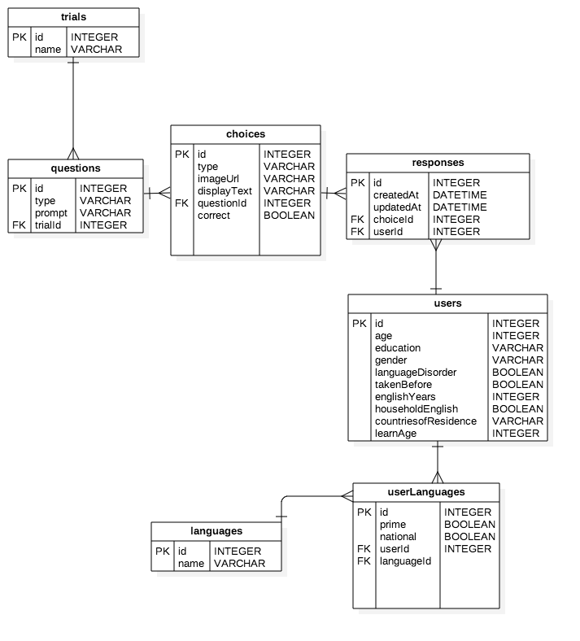

# Pushkin-DB


# Overview
This DB worker has a simple job with a relatively open API.
There is a worker class that handles writes and reads through a message queue.
All models are defined in `./models/`
any bookshelf model that is defined in there will automatically get methods added to the worker class.
add custom methods in `worker.js` to do custom functionality

# Core Features
* regulates and controls DB access in a structured manner
* provides multi client asynchronos access to the db with persistence and the ability to survive restarts/crashes.
* provides multi DB logging, with every transaction on the primnary being logged and saved in a secondary DB.
* uses Bookshelf.js/knex.js as its core ORM for an easiliy extensible way to define models
* provides an easy to use structure for seeds
* tested



# Get started
1. Creating/modifying the db migrations in the `migrations` directory to match your schema
2. Create/modify the bookshelf models found in `models` directory (they will be automatically sourced in by the db reader)
3. Create/modify the csv files found in `seeds/`

# Pushkin-db Folder Structure
pushkin-db consists the following important folders and files: 

`/migrations` 
- migration files created by `pushkin generate model [yourQuizName]` will be listed in this folder. 
- `pushkin generate model [yourQuizName]` will create 5 basic tables: `users`, `responses`, `trials`, `questions`, and `choices`
- The file names are in this format : `[timeStamp]_create_[yourQuizName]_[table].js`
- example: `migrations/20170515072132_create_whichenglish_trials.js`

`/models`
- bookshelf models created by `pushkin generate model [yourQuizName]` will be listed in this folder.
- `pushkin generate model [yourQuizName]` will create 5 basic bookshelf models: `users`, `responses`, `trials`, `questions`, and `choices`
- bookshelf model files generated are grouped in [yourQuizName] folder under this directory
- example: `models/whichenglish/user.js`

`/seeds`
- seed files created by `pushkin generate model [yourQuizName]` will be listed in this folder.
- `pushkin generate model [yourQuizName]` will create 3 basic CSV templates and a `index.js` file
- seed files generated are grouped in [yourQuizName] folder under this directory
- you could fill out these csv files by using a csv editor or your text editor. These data filled in are your actual data for `[yourQuizName]`. When you are filling out these csv files, make sure you have the correct trial name in `Questions.csv`, this handles the relation between a trial and it’s questions/choices
- example: `seeds/whichenglish/Choice.csv`

`/seeder.js`
- this is the overarching seeder file that handles seeding [yourQuizName]. Please see Seed Quiz section of this read me for more information

`/worker.js`
- this file lists all the DB methods used by the routes. Please see Worker section of this read me for more information

# Extension
* Change the timezone to whatever you want by setting the `TZ` env variable in the `Dockerfile`
* Share and publish other scripts that you may find useful

<a name="Worker"></a>

## Worker
**Kind**: global class

* [Worker](#Worker)
    * [new Worker()](#new_Worker_new)
    * [.createModel(data)](#Worker+createModel) ⇒ <code>Promise</code>
    * [.findModel(id, [relations])](#Worker+findModel) ⇒ <code>Promise</code>
    * [.updateModel(id, data)](#Worker+updateModel) ⇒ <code>Promise</code>
    * [.deleteModel(id)](#Worker+deleteModel) ⇒ <code>Number</code>
    * [.queryModel(query, relations)](#Worker+queryModel) ⇒ <code>Promise</code>
    * [.rawModel(query)](#Worker+rawModel) ⇒ <code>Promise</code>
    * [.allModels()](#Worker+allModels) ⇒ <code>Promise</code>
    * [.getInitialQuestions(trialName)](#Worker+getInitialQuestions) ⇒ <code>Promise</code>
    * [.setUserLanguages(userId, set)](#Worker+setUserLanguages) ⇒ <code>Promise</code>
    * [.getResults(userId)](#Worker+getResults) ⇒ <code>Promise</code>

<a name="new_Worker_new"></a>

### new Worker()
DB writer and reader class with automatically generated methods
**These methods are created automatically based off what it defined by bookshelf**

<a name="Worker+createModel"></a>

### worker.createModel(data) ⇒ <code>Promise</code>

Create a new Model in the DB

**Kind**: instance method of <code>[Worker](#Worker)</code>

**Returns**: <code>Promise</code> - The saved model

**Fulfill**: <code>Object</code>

**Reject**: <code>Error</code>

| Param | Type | Description |
| --- | --- | --- |
| data | <code>any</code> | model to be created |

**Example**

```js
createUser({ name: "Methuselah", age: 1000 })
```
<a name="Worker+findModel"></a>

### worker.findModel(id, [relations]) ⇒ <code>Promise</code>

**Kind**: instance method of <code>[Worker](#Worker)</code>

**Fulfill**: <code>Object</code> - The found model

**Reject**: <code>Error</code>

| Param | Type | Description |
| --- | --- | --- |
| id | <code>number</code> | The id of the model looking for |
| [relations] | <code>Array.&lt;string&gt;</code> | an array of related models to fetch |

**Example**

```js
findUser(1, ['posts'])
```
<a name="Worker+updateModel"></a>

### worker.updateModel(id, data) ⇒ <code>Promise</code>

**Kind**: instance method of <code>[Worker](#Worker)</code>

**Fulfill**: <code>Object</code> - The newly updated model

**Reject**: <code>Error</code>

| Param | Type | Description |
| --- | --- | --- |
| id | <code>number</code> | the id of the model being updated |
| data | <code>Object</code> | the data to update |

**Example**

```js
updateUser(1, { age: 969 })
```
<a name="Worker+deleteModel"></a>

### worker.deleteModel(id) ⇒ <code>Number</code>

**Kind**: instance method of <code>[Worker](#Worker)</code>

**Returns**: <code>Number</code> - 0 if success

| Param | Type | Description |
| --- | --- | --- |
| id | <code>Number</code> | the id of the model to be deleted |

**Example**
```js
deleteUser(1);
```
<a name="Worker+queryModel"></a>

### worker.queryModel(query, relations) ⇒ <code>Promise</code>

**Kind**: instance method of <code>[Worker](#Worker)</code>

**Fulfill**: <code>Object[]</code> - An array of models returned

**Reject**: <code>Error</code>

| Param | Type | Description |
| --- | --- | --- |
| query | <code>Array.&lt;Array.&lt;string&gt;&gt;</code> | a knex.js query array see http://knexjs.org/#Builder |
| relations | <code>Array.&lt;string&gt;</code> | an Array of relations |

**Example**
```js
queryModel([
 ['where', 'other_id', '=', '5'],
 ['where', 'name', '=', 'foo']
],
['posts']
)
```
<a name="Worker+rawModel"></a>

### worker.rawModel(query) ⇒ <code>Promise</code>
Allows raw queries on DB

**Kind**: instance method of <code>[Worker](#Worker)</code>

**Fulfill**: <code>Object[]</code> - an array of results

**Reject**: <code>Error</code>

| Param | Type | Description |
| --- | --- | --- |
| query | <code>Array.&lt;Array.&lt;String&gt;&gt;</code> | a raw knexjs query array |

**Example**
```js
rawUser([
  ['where', 'name', '=', 'Methuselah'],
  ['where', 'age', '>', 900 ],
])
```
<a name="Worker+allModels"></a>

### worker.allModels() ⇒ <code>Promise</code>
Return all models in DB

**Kind**: instance method of <code>[Worker](#Worker)</code>

**Fulfill**: <code>Object[]</code> -  all models in DB

**Reject**: <code>Error</code>

**Example**

```js
allUsers()
```
<a name="Worker+getInitialQuestions"></a>

### worker.getInitialQuestions(trialName) ⇒ <code>Promise</code>
Return all models in DB

**Kind**: instance method of <code>[Worker](#Worker)</code>

**Fulfill**: <code>Object[]</code> -   questions for that Trial

**Reject**: <code>Error</code>

**Todo**
- [ ] Make this query on the trial Name


| Param | Type | Description |
| --- | --- | --- |
| trialName | <code>string</code> | The name of the trial looking for inital questions for |

<a name="Worker+setUserLanguages"></a>

### worker.setUserLanguages(userId, set) ⇒ <code>Promise</code>
Sets a users Languages

**Kind**: instance method of <code>[Worker](#Worker)</code>

**Fulfill**: <code>Object</code> - the user with their languages

**Rejects**: <code>Error</code>

| Param | Type | Description |
| --- | --- | --- |
| userId | <code>number</code> | the name of the id to set |
| set | <code>Object</code> |  |
| set.primaryLanguages | <code>Array.&lt;String&gt;</code> | the user's primary Languages |
| set.nativeLanguages | <code>Array.&lt;String&gt;</code> | the user's native Languages |

**Example**
```js
setUserLanguages(1, {
 primaryLanguages: ["Hebrew", "Aramaic"],
nativeLanguages: ["Hebrew"]
})
```
<a name="Worker+getResults"></a>

### worker.getResults(userId) ⇒ <code>Promise</code>
Get the results from the DB

**Kind**: instance method of <code>[Worker](#Worker)</code>

**Fulfill**: <code>Object[]</code> - an array of the top 3 languages for this user

**Rejects**: <code>Error</code>

| Param | Type | Description |
| --- | --- | --- |
| userId | <code>number</code> | the user whose results you are grabbing |

# Seed Quiz
#### IMPORTANT! Before you start ...
Please ensure all things listed below: 
- make sure pushkin docker container is running. please execute `docker-compose -f docker-compose.debug.yml up` in your main `pushkin` folder.

- make sure you’ve properly created a model `pushkin generate model [yourQuizName]`, all of the migration files, model files and seed files could be found under `pushkin-db/migrations`, `pushkin-db/models`, and `pushkin-db/seeds`.

- make sure you’ve properly filled out all of your seed csv files in `pushkin-db/seeds/[yourQuizName]`. Please double make sure you have the correct trial name in `Questions.csv`, this handles the relation between a trial and it’s questions/choices

- make sure you’ve ran your migrations after the model is created

#### Instructions
After you've ensured all listed in Before you start section of this read me, you are ready to seed a quiz: 
1. bash into pushkin_db-worker_1 : `bash -c "clear && docker exec -it pushkin_db-worker_1 sh”`
2. execute `node seeder.js [yourQuizName]` example `node seeder.js whichenglish`. When you are running this command, make sure [yourQuizName] matches the model you’ve created for this quiz. whichenglish is not the same as whichEnglish.
3. if you see "done seeding!" in your terminal, you are all done!

#### How does it work:
long story short, when you are generating the model for your quiz, it grabs the seeds templates and copies the file over to `pushkin-db/seeds/[yourQuizName]`. there will be a `index.js` in each of the models you’ve generated. By looking into the csv files in the current quiz folder, this file inserts the proper data into each table corresponding to the current quiz. As you can see, each of these `index.js` files exports a function for the main seeder.js to use. 

The main seeder.js listens to the command `node seeder.js [yourQuizName]`, it grabs the second argument which is `yourQuizName` and looks for its corresponding folder in `pushkin-db/seeds/`. After it’ve found the `index.js` in that folder, it simply execute the function that is being exported and run it. That’s it!

#### How to modify your seed files:
If you are unhappy with the data inserted in the csv files, please feel free to modify them by using a csv tool(recommended), or in your text editor. 
If you’ve modified your tables, and you need to change the seed files, please go to the quiz seed file your want to change under `pushkin-db/seeds/[yourQuizName]/index.js`.The current setup in these `index.js` files is: 
- reads the csv files in the current quiz folder
- deletes any data left in the tables
- inserts a fresh copy of the csv data to the tables

You could add your code on top of what we have, we are  using `knex` to handle insertions and deletions. As long as it make sense to the tables you’ve modified ;)
if you just can’t stand the confirmations we currently have when you execute`node seeder.js [yourQuizName]`, simply goto the main `seeder.js` file in `pushkin-db`, you could take out the warnings or mess with the copy change in the warning messages, change their colors, etc. It’s up to you. Seriously. 

#### Extension
If you’ve changed your table relations, please make sure to change the bookshelf models (`pushkin-db/models/[yourQuizName]`) to match the modified tables! 
