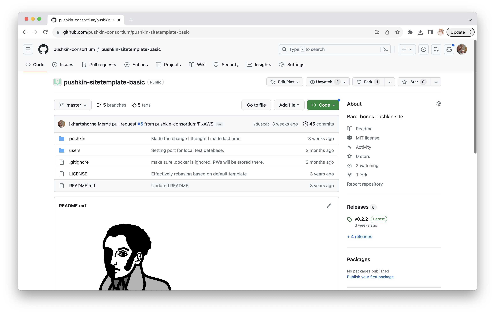
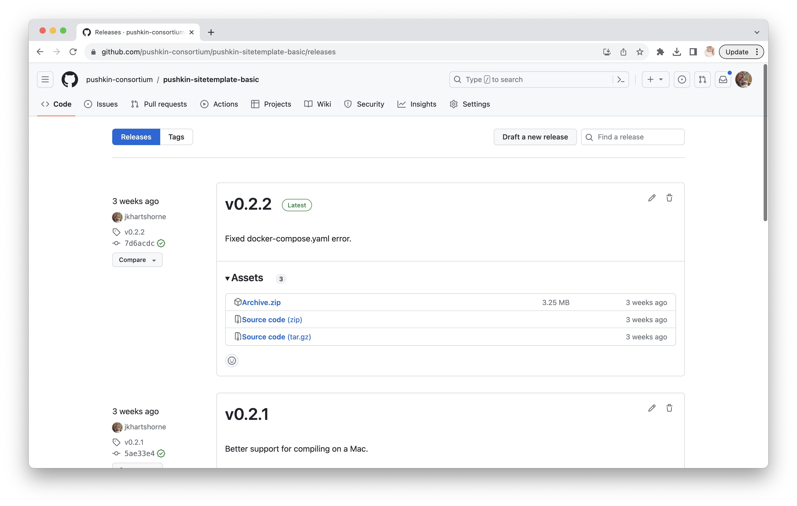
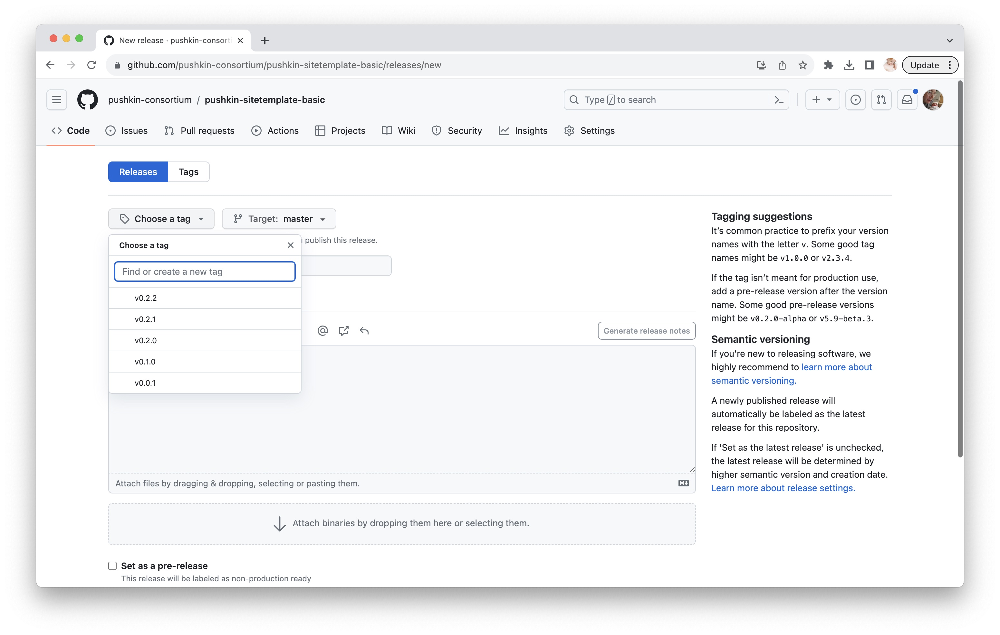
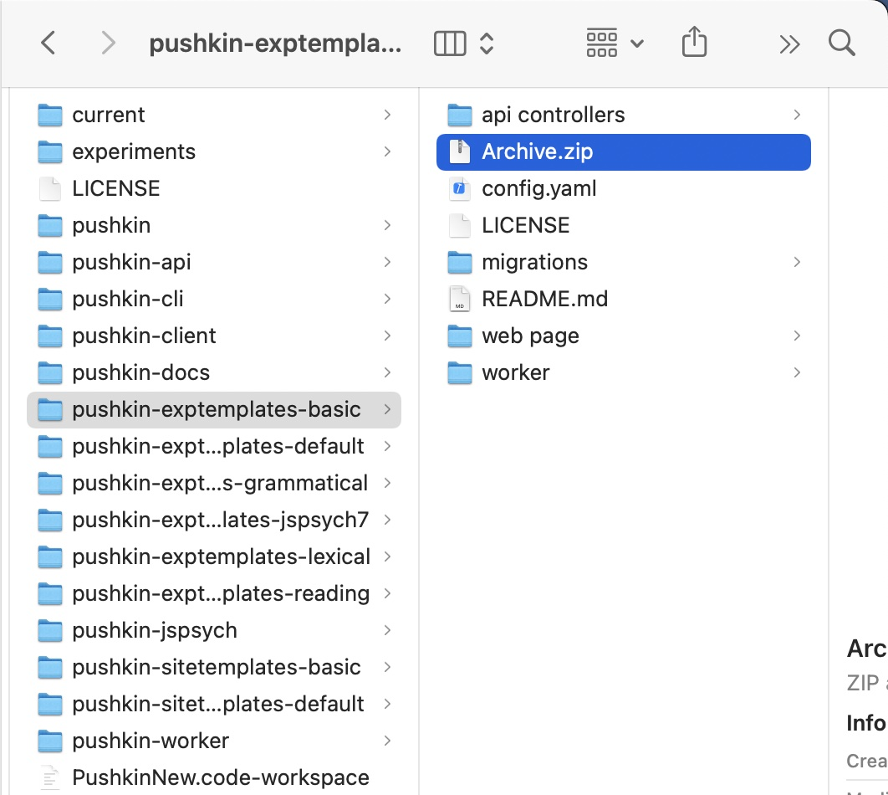
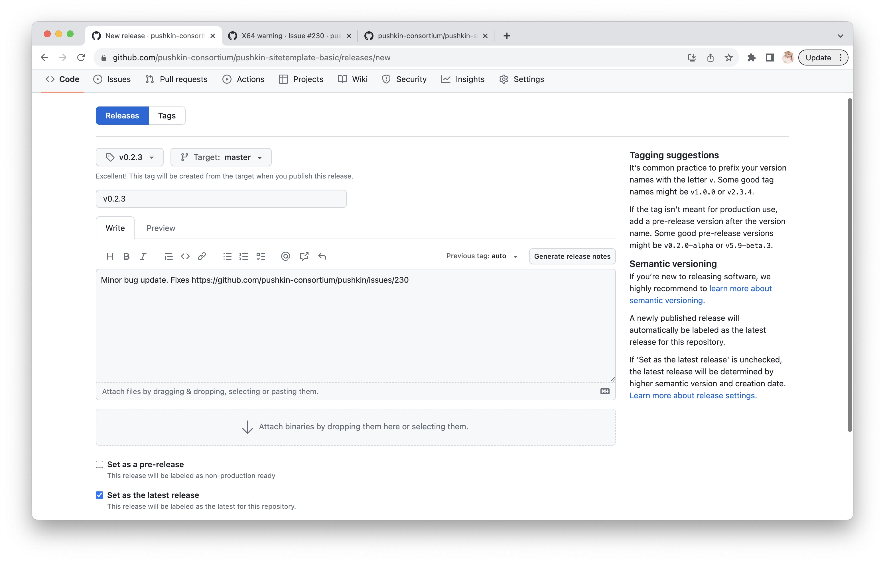

# Working with Templates

## Publishing a template

The Pushkin CLI `install` command is integrated with the GitHub release functionality. On the GitHub website, there is a `releases` panel on the right-hand side of the repo homepage. 



Click on the panel to open the releases page. Then select `draft new release`.



The Pushkin CLI assumes semantic versioning. You will need to create a tag for your release of the form `vX.Y.Z`. GitHub has a reasonable explanation on this page (see right-hand side).



You can choose whatever title you want. We suggest you include an informative description of this particular release. If it's the first release for your project, you might just put in the description "initial release". This is up to you.

What is critical is that you zip up the files in your repo into a file called `Archive.zip`. Do NOT zip up the whole folder, but rather the files inside. This is what the Pushkin CLI expects. Moreover, on a Mac, at least, this will ensure that hidden files and folders are not included. 



On the `draft new release` page, you should see the option to `attach binaries by dropping them here or selecting them`. Use that option to upload `Archive.zip`. 



Then click `publish release` and you are done. 

### Using a self-published template

Run `pushkin install site` or `pushkin install experiment`, depending on which sort of template you are using. When asked where to install from, choose `url`. The URL is just the URL for your repo, with `/releases` added to the end:

`https://github.com/pushkin-consortium/pushkin-sitetemplate-basic/releases`

If you've followed the instructions in the previous section correctly, and if your template meets the requirements of the Pushkin CLI, this should work.

### Adding your template to the official Pushkin distribution.

If you haven't already, fork `pushkin-cli`. If you are adding a site template, you will want to modify the file `pushkin-cli/src/commands/sites/templates.js`:

```
export const templates = {
   'default':'https://api.github.com/repos/pushkin-consortium/pushkin-sitetemplates-default/releases'
};
```

Add your template to the list, using the api URL. This is the one described in the previous section, but where the domain is `api.github.com` instead of just `github.com`. (Probably the latter will work, but it hasn't been tested.)

```
export const templates = {
   'default':'https://api.github.com/repos/pushkin-consortium/pushkin-sitetemplates-default/releases',
   'basic':  'https://api.github.com/repos/pushkin-consortium/pushkin-sitetemplate-basic/releases'
};
```

For experiment templates, the process is analogous, but the file is in `pushkin-cli/src/commands/experiments/tempaltes.js`.

Now make a pull request. Make sure that the repo for your template is public so that the pushkin team can review it. 