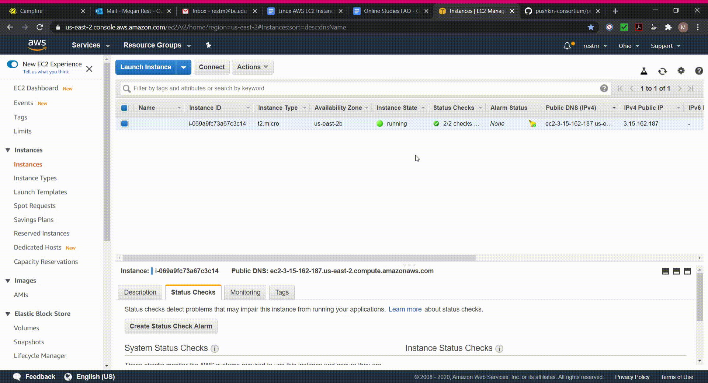

#AWS EC2 Instance

Although it is dispreferred, users can choose to create a free-tier [Amazon Web Services \(AWS\) EC2](https://aws.amazon.com/ec2/) instance for using and deploying Pushkin as an alternative to using WSL on Windows. In your instance, you will be able to run an Ubuntu virtual machine and follow the Ubuntu setup instructions. We suggest accessing this AWS EC2 instance from your local computer using the [PuTTY SSH client](https://www.chiark.greenend.org.uk/~sgtatham/putty/), though in principle any SSH client for Windows should work.

## Skip to section

* [Create your AWS EC2 instance](ec2-install.md#create-your-aws-ec2-instance)
* [Install and configure PuTTY](ec2-install.md#install-and-configure-putty) 
* [Connect to your EC2 instance](ec2-install.md#connect-to-your-ec2-instance)
* [Managing your AWS instance](ec2-install.md#managing-your-aws-instance)
* [Next steps](ec2-install.md#next-steps)

### Create your AWS EC2 instance

#### Create your AWS Account

Go to [Amazon Web Services](https://aws.amazon.com/free/) and click _Create a free account_.


Complete the sign-up process and go to your inbox to confirm your email address.

#### Launch your EC2 Instance

Head to the [AWS EC2 console](https://console.aws.amazon.com/ec2/v2/home) and, in the left sidebar, click _Instances_.


Click on the _Launch Instance_ button. In the left sidebar, click the _Free tier only_ check box.


Then, scroll down to **Ubuntu Server 18.04 LTS** and click _Select_.


On the next page, click _Review and launch_ in the bottom-right corner.


Next, under the **Security Groups** heading, select _Edit Security Groups_ on the right-hand side.


Select _Add rule_ scroll down and, under _Type_, choose **HTTP** in the drop-down menu. Then, select _Add rule_ again and, under _Type_, select "HTTPS". Then click _Review and Launch_ in the bottom-right corner.


Click **Launch** then create a new key pair and give it a name, \(e.g., "pushkin-testing-key"\) and press **Download Key Pair**. Keep track of where this key has downloaded \(it will have a ".pem" extension\), as you will need this to connect to your instance later.


Once the key has downloaded, press **Launch Instance**.


Next, in the box that says "Your instances are now launching," click the instance ID, which will be an alphanumeric string.


This will take you to the AWS EC2 console. You should keep this window open.

### Install and configure PuTTY

Now that you have launched the Ubuntu instance, you can connect to it. We recommend using PuTTY for this. Instructions for configuring PuTTY to connect to your EC2 instance can be found [here](https://docs.aws.amazon.com/AWSEC2/latest/UserGuide/putty.html) and are copied here for convenience.

First, download and install [PuTTY](https://www.chiark.greenend.org.uk/~sgtatham/putty/).


In the Windows start menu, open **PuTTYgen**.

Under **Type of key to generate**, choose **RSA**. If you're using an older version of PuTTYgen, choose **SSH-2 RSA**.


Choose **Load**. By default, PuTTYgen displays only files with the extension ".ppk". To locate your ".pem" file, choose the option to display all file types. Select the ".pem" file and choose **Open**. On the notice that pops up, choose **OK**.


To save the key in the format that PuTTY can use, choose **Save private key**. PuTTYgen displays a warning about saving the key without a passphrase. Choose **Yes**.


Specify the same name for the key that you used for the key pair \(in this example, "pushkin-testing-key"\) and choose **Save**. PuTTY automatically adds the ".ppk" file extension. After this you can close PuTTYgen.

### Connect to your EC2 instance

In the Windows start menu, open **PuTTY**.

In the **Category** pane, choose **Session**.


In the _Host Name_ box, enter "ubuntu@" followed by the public DNS of your instance.


The public DNS is found on the AWS EC2 console. One example is "ec2-18-191-193-31.us-east-2.compute.amazonaws.com". The 2- and 3-digit numbers will be different for each instance and "us-east-2" is based on what region you are in.


Ensure that the _Port value_ is **22**, the under _Connection type_ select **SSH**.


In the Category pane, expand **Connection**, expand **SSH**, then choose **Auth**.


Choose **Browse**, then select the ".ppk" file you generated for your key pair and choose **Open**.


If you plan to start the session again later, you can save the session information. Under _Category_, choose **Session**, enter a name for the session in _Saved Sessions_, and then choose **Save**.

**Note:** When you stop running the AWS instance from the AWS console, on restart the IP address and the Public DNS will be different. If you save your settings in PuTTY, you will need to replace part of your host name with the new IP address. All other saved settings remain the same.


You can now choose **Open** to connect to your instance. PuTTY will display a security alert dialog box asking if you trust the host you are connecting to: choose **Yes**.


You are now connected to your instance! In the window that appears, run the following commands to update your Ubuntu EC2 instance:

```bash
$ sudo apt update
$ sudo apt upgrade
```


While upgrading, a box may come up that says the following:

```text
A new version of /boot/grub/menu.lst is available, but the version installed currently has been locally modified.
```

Use the UP arrow key to select `install the package maintainer's version` and press ENTER to continue.


\(For more on package management with apt, you can see the documentation [here](https://ubuntu.com/server/docs/package-management). To learn more about the basics of the Linux command line, you can follow [this tutorial](https://ubuntu.com/tutorials/command-line-for-beginners#1-overview).\)

### Managing your AWS instance

#### Remember to stop your instance

To avoid incurring charges on AWS's Free Tier, always shut down your AWS EC2 instance when you're done using it. To do this, go to the AWS EC2 console, right-click on your instance, expand _Instance State_, and select **Stop**. When a dialog box appears, click **Yes, Stop**.



#### How to restart your instance

To restart your instance, go to the AWS EC2 console, right-click on your instance, expand _Instance State_, and select **Start**.


### Next steps

From here, you can follow the instructions for [Ubuntu Linux](ubuntu-install.md) to finish the installation.

