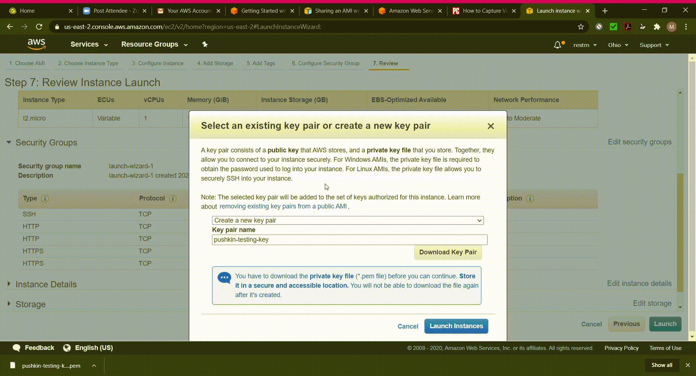
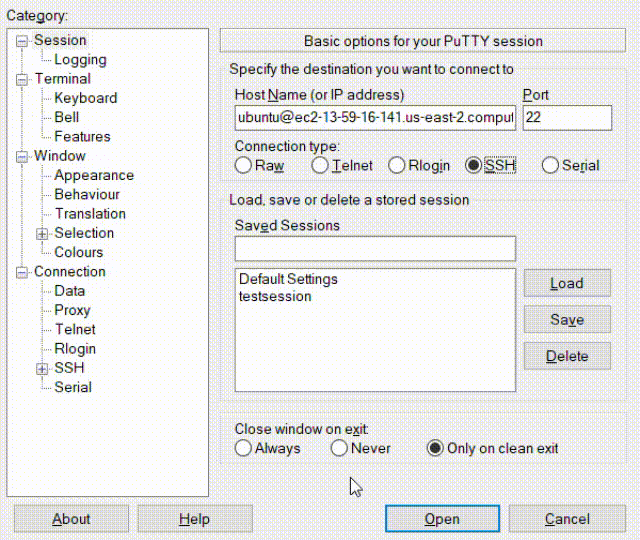

# Windows 10

We are eventually hoping to be able to use the [Windows Subsystem for Linux (WSL)](https://docs.microsoft.com/en-us/windows/wsl/) to deploy Pushkin on your local Windows computer. This setup is not currently working reliably, however, but when Microsoft releases a fix, we will update our documentation accordingly.

For now, we suggest that Windows users create a free-tier [Amazon Web Services (AWS) EC2](https://aws.amazon.com/ec2/) instance, where you will be able to run a Ubuntu virtual machine and follow the Ubuntu tutorial instructions. We suggest accessing this AWS EC2 instance from your local computer using the [PuTTY SSH client](https://www.chiark.greenend.org.uk/~sgtatham/putty/), though in principle any SSH client for Windows should work.

## Skip to section

* [Create your AWS EC2 instance](windows-install.md#create-your-aws-ec2-instance)
* [Install and configure PuTTY](windows-install.md#install-and-configure-putty) 
* [Connect to your EC2 instance](windows-install.md#connect-to-your-ec2-instance)
* [Next steps](windows-install.md#next-steps)

### Create your AWS EC2 instance

#### Create your AWS Account

Go to [Amazon Web Services](https://aws.amazon.com/free/) and click *Create a free account*.


Complete the sign-up process and go to your inbox to confirm your email address.

#### Launch your EC2 Instance

Head to the [AWS EC2 console](https://console.aws.amazon.com/ec2/) and, in the left sidebar, click *Instances*.


Click on the *Launch Instance* button. In the left sidebar, click the *Free tier only* checkbox. Then, scroll down to **Ubuntu Server 18.04 LTS** and click *Select*.


On the next page, click *Review and launch* in the bottom-right corner.


Next, under the **Security Groups** heading, select *Edit Security Groups* on the right-hand side.


Select *Add rule* scroll down and, under *Type*, choose **HTTP** in the drop down menu. Then, select *Add rule* again and, under *Type*, select "HTTPS". Then click *Review and Launch* in the bottom-right corner.


Click **Launch** then create a new key pair and give it a name, (e.g., "pushkin-testing-key") and press **Download Key Pair**. Keep track of where this key has download (it will have a ".pem" extension), as you will need this to connect to your instance later.




Once the key has downloaded, press **Launch Instance**.

Next, in the box that says "Your instances are now launching," click the instance ID, which will be an alphanumeric string.


This will take you to the AWS EC2 console. You should keep this window open.


### Install and configure PuTTY

Now that the Ubuntu instance has been launched, you have to connect to it. We recommend using PuTTY for this. Instructions for using configuring PuTTY to connect to your EC2 instance can be found [here](https://docs.aws.amazon.com/AWSEC2/latest/UserGuide/putty.html) and are copied here for convenience.

First, download and install [PuTTY](https://www.chiark.greenend.org.uk/~sgtatham/putty/).


In the Windows start menu, open **PuTTYgen**. 

Under **Type of key to generate**, choose **RSA**. If you're using an older version of PuTTYgen, choose **SSH-2 RSA**.


Choose **Load**. By default, PuTTYgen displays only files with the extension ".ppk". To locate your ".pem" file, choose the option to display all file types then select your ".pem" file for the key pair you specified when you launched your instance and choose **Open**. On the notice that pops up, choose **OK**.


To save the key in the format that PuTTY can use, choose **Save private key**. PuTTYgen displays a warning about saving the key without a passphrase. Choose **Yes**.


Specify the same name for the key that you used for the key pair (in this example, "pushkin-testing-key") and choose **Save**. PuTTY automatically adds the ".ppk" file extension. After this you can close PuTTYgen.


### Connect to your EC2 instance

In the Windows start menu, open **PuTTY**.

In the **Category** pane, choose **Session**.


In the Host Name box, enter "ubuntu@" followed by the public DNS of your instance. 


The public DNS is found on the AWS EC2 console. One example is "ec2-18-191-193-31.us-east-2.compute.amazonaws.com". The 2- and 3-digit numbers will be different for each instance and "us-east-2" is based on what region you are in.


Ensure that the *Port value* is **22**, the under *Connection type* select **SSH**.


In the Category pane, expand **Connection**, expand **SSH**, then choose **Auth**.



Choose **Browse**, then select the .ppk file you generated for your key pair and choose **Open**.


If you plan to start the session again later, you can save the session information. Under *Category*, choose **Session**, enter a name for the session in *Saved Sessions*, and then choose **Save**.


You can now choose **Open** to connect to your instance. PuTTY will display a security alert dialog box asking if you trust the host you are connecting to: choose **Yes**.


You are now connected to your instance! In the window that appears, run the following commands to ensure your instance of Ubuntu EC2 instance is updated:

```bash
$ sudo apt update
$ sudo apt upgrade
```


\(For more on package management with apt, you can see the documentation [here](https://ubuntu.com/server/docs/package-management). To learn more about the basics of the Linux command line, you can follow [this tutorial](https://ubuntu.com/tutorials/command-line-for-beginners#1-overview).\)

### Next steps

From here, you can follow the instructions for [Ubuntu Linux](ubuntu-install.md) to finish the installation.
