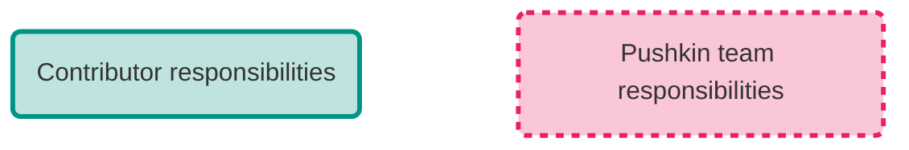

# Contributing to Pushkin

We encourage contributions of all kinds, including changes to the Pushkin CLI and its supporting packages, development of new site and experiment templates, and improvements to the documentation.

The project is managed entirely through Pushkin's [GitHub repository](https://github.com/pushkin-consortium/pushkin). There you can:

- Use [discussions](https://github.com/pushkin-consortium/pushkin/discussions) to propose ideas for development and seek feedback on potential contributions.
- Use [issues](https://github.com/pushkin-consortium/pushkin/issues) to track actionable next steps for contributions, like a page in the documentation that needs to be fixed, a bug in the code, or a specific feature with a clear scope.
- Submit a [pull request](https://github.com/pushkin-consortium/pushkin/pulls) with updates to the code. Pull requests will be reviewed by one or more members of the core team.

## Guidelines for contributing

### Contributing to the codebase

We welcome contributions of any scope. To facilitate a smooth integration into the main codebase, we generally require a few things:

- **Updated relevant documentation:** Any pages in `/docs` affected by your contribution should be updated. If new pages are needed, please create them. For instance, if you're contributing a new experiment template, we would expect that you:
    - Add a documentation page to `/docs/exp-templates` with the format `exp-<my-exp-name>.md`.
    - Update the [mkdocs configuration file](https://github.com/pushkin-consortium/pushkin/blob/main/mkdocs.yml) so that your new page shows up in the site navigation bar.
    - Update the list of available templates in the [overview of experiment templates](../exp-templates/exp-templates-overview.md).
   
- **Inclusion of a changeset:** Pushkin uses [changesets](https://github.com/atlassian/changesets/blob/main/docs/adding-a-changeset.md) as part of our release workflow for all packages published to npm (i.e., anything in [`/packages`](https://github.com/pushkin-consortium/pushkin/blob/main/packages) or [`/templates`](https://github.com/pushkin-consortium/pushkin/blob/main/templates)). Please include a changeset in your pull request. [This overview](https://github.com/atlassian/changesets/blob/main/docs/adding-a-changeset.md) explains how to add one. The Pushkin team is happy to provide guidance on this, but some general points to keep in mind:
    - Changesets handles bumping versions of the packages you change; don't manually increment the version number in `package.json`.
    - If you change is small enough for a single commit, it's nice to include the changeset in the commit.
    - If your changes are more substantial and merit multiple commits, add the changeset to whichever commit you like (one of the final ones is probably most sensible). You don't need to include a changeset with every commit.
    - In less common cases, your pull request might merit multiple changesets. Example situations might be if you are making unrelated changes to separate packages or a mix of patches and new features.

- **Code style and quality:** Contributions should follow the established coding standards and practices of the project. This includes writing clean, readable, and well-documented code. Please ensure that new code passes all existing tests and, where applicable, add new tests to cover your updates.

!!! warning "Security vulnerabilities"
    If your potential contribution relates to a security vulnerability, please refer to our [security policy](../support/security.md) for guidance on reporting it privately.

### Contributing to the documentation

Contributions to documentation, whether small corrections or adding new tutorials, are highly valued. The source files for this site can be found in the [`/docs`](https://github.com/pushkin-consortium/pushkin/blob/main/docs) folder of the Pushkin GitHub repository. Consult our instructions for [building the docs locally](./documentation.md) in order to preview your updates. Contributions which affect _only_ the documentation do _not_ require a changeset (cf. [Contributing to the codebase](#contributing-to-the-codebase)).

## Contribution flowchart

The flowchart below should give potential contributors an idea of what to expect. Action items specific to contributors and Pushkin team members are called out specifically as below:



As you'll notice, contributors' responsibilities are limited to the [development](#phase-i-development) phase of the procedure, but the [deployment](#phase-ii-deployment) phase is shown in the second tab for completeness and instructive purposes.

=== "Phase I: Development"
    ```mermaid
        flowchart TB
            START{START}
            changes(Contributor makes changes in development fork)
            what_changed(Do changes affect anything published to npm?)
            changeset_needed(Contributor adds changeset)
            commit(Contributor commits changes)
            more_changes(Does contributor want to make additional changes?)
            pull_request(Contributor makes pull request on main)
            review(Pushkin team reviews pull request)
            review_changes(Are additional changes needed?)
            update_pr(Contributor commits requested changes)
            accept_pr(Pushkin team accepts pull request)

            START:::terminal --> changes:::contributor
            changes --> what_changed:::non-action
            what_changed -- Yes --> changeset_needed:::contributor
            what_changed -- No --> commit:::contributor
            changeset_needed --> commit
            commit --> more_changes:::non-action
            more_changes -- Yes --> changes:::contributor
            more_changes -- No --> pull_request:::contributor
            pull_request --> review:::pushkin-team
            review --> review_changes:::non-action
            review_changes -- Yes --> update_pr:::contributor
            update_pr --> review_changes
            review_changes -- No --> accept_pr:::pushkin-team

            classDef terminal font-weight:bolder,fill:transparent
            classDef non-action fill:transparent
            classDef contributor stroke:#009485,stroke-width:3px,stroke-opacity:1,fill:#009485,fill-opacity:0.25
            classDef pushkin-team stroke:#e92063,stroke-width:3px,stroke-opacity:1,stroke-dasharray:5,fill:#e92063,fill-opacity:0.25
    ```
=== "Phase II: Deployment"
    ```mermaid
        flowchart TB
            accept_pr(Pushkin team merges contributor's changes)
            what_changed(Do changes affect anything published to npm?)
            docs_affected(Do changes affect docs?)
            changesets_action(
                Changesets workflow is triggered;
                changesets are digested into changelogs;
                version numbers are incremented;
                workflow makes another pull request on main
            )
            accept_pr2(Pushkin team merges changes again)
            changesets_action2(
                Changesets workflow is triggered again;
                updated packages are published to npm
            )
            docs_deploy(Pushkin team publishes updated docs)
            END{END}

            accept_pr:::pushkin-team --> what_changed:::non-action
            what_changed -- Yes --> changesets_action:::non-action
            what_changed -- No --> docs_affected:::non-action
            changesets_action --> accept_pr2:::pushkin-team
            accept_pr2 --> changesets_action2:::non-action
            changesets_action2 --> docs_affected
            docs_affected -- Yes --> docs_deploy:::pushkin-team
            docs_affected -- No --> END:::terminal
            docs_deploy --> END

            classDef terminal font-weight:bolder,fill:transparent
            classDef non-action fill:transparent
            classDef contributor stroke:#009485,stroke-width:3px,stroke-opacity:1,fill:#009485,fill-opacity:0.25
            classDef pushkin-team stroke:#e92063,stroke-width:3px,stroke-opacity:1,stroke-dasharray:5,fill:#e92063,fill-opacity:0.25
    ```

## Licensing and copyright

By contributing to Pushkin, you agree that your contributions will be licensed under the [MIT License](../about/pushkin-license.md). This means that your contributions can be freely used, modified, and shared by others under the same terms. Please ensure you have the right to submit any work you contribute.
