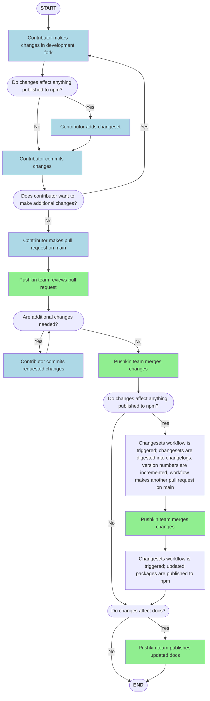

# Contributor Guidelines

We encourage contributions of all kinds, including changes to the core codebase, development of new sites and templates, and improvements to the documentation.

The project is managed entirely through the [GitHub repository](https://github.com/pushkin-consortium/pushkin). There you can:

* Use [discussions](https://github.com/pushkin-consortium/pushkin/discussions) to propose ideas for development and seek feedback on contributions, such as a new plugin.
* Use [issues](https://github.com/pushkin-consortium/pushkin/issues) to identify anything with an actionable next step, like a page in the documentation that needs to be fixed, a bug in the code, or a specific feature with a clear scope.
* Submit a [pull request](https://github.com/pushkin-consortium/pushkin/pulls) with modifications to the codebase. Pull requests will be reviewed by one or more members of the core team.

We understand that many users of Pushkin might not have a background in coding or software development. To make your journey with Pushkin more accessible and enjoyable, we reccomend familiarizing yourself with essential tools like [Git](https://www.git-tower.com/learn/git/ebook/en/desktop-gui/basics/what-is-version-control), [Github](https://docs.github.com/en/get-started/quickstart), and the process of making [Pull Requests](https://opensource.com/article/19/7/create-pull-request-github) (PRs)

## Licensing and Copyright

By contributing to Pushkin, you agree that your contributions will be licensed under the [MIT License](../about/pushkin-license.md). This means that your contributions can be freely used, modified, and shared by others under the same terms. Please ensure you have the right to submit any work you contribute.

## Reporting Security Vulnerabilities

!!! warning
    **If you believe you have found a security vulnerability that is too dangerous to be shared publicly, please refer to our [security policy](./security.md) for guidance on reporting it privately.**
    
## Guidelines for Contributing

### Contributing to the Codebase

We welcome contributions of any scope. To facilitate a smooth integration into the main codebase, we generally require a few things:

* **Updated Relevant Documentation:** Any pages in `/docs` affected by your contribution should be updated. If new pages are needed, please create them. For instance, if contributing a template, adding documentation for the plugin and updating the [mkdocs configuration file](https://github.com/pushkin-consortium/pushkin/blob/main/mkdocs.yml) is very helpful!
* **Inclusion of a Changeset:** Our project uses [changesets](https://github.com/atlassian/changesets/blob/main/docs/adding-a-changeset.md) to generate new releases and their corresponding release notes. Please include a changeset in your pull request. [This overview](https://github.com/atlassian/changesets/blob/main/docs/adding-a-changeset.md) explains how to add one. Feel free to ask for help with this!
* **Code Style and Quality:** Contributions should follow the established coding standards and practices of the project. This includes writing clean, readable, and well-documented code. Please ensure that new code passes all existing tests and, where applicable, add new tests to cover your changes.

### Contributing to the Documentation

Contributions to documentation, whether small corrections or adding new tutorials, are highly valued. All documentation on our site is in the [`/docs` folder](https://github.com/pushkin-consortium/pushkin/blob/main/docs) of the repository. It's built using [MkDocs](https://www.mkdocs.org/) and themed with [Material for MkDocs](https://squidfunk.github.io/mkdocs-material/). You can edit the markdown files and submit a pull request for changes.

For substantive changes, it's best to build and view the site locally using poetry to test your modifications. After making changes in your development branch/fork, follow [these steps](./documentation.md) to test the site.

### Community Standards and Conduct

1. **Friendly and Patient:** Approach interactions with kindness and patience.

2. **Welcoming:** Embrace diversity in all its forms, respecting different backgrounds and identities. This inclusivity covers aspects such as race, ethnicity, social status, gender identity, age, and more.

3. **Considerate:** Recognize that your decisions impact users and colleagues. As we're a community, be mindful of language barriers.

4. **Respectful:** Maintain a respectful demeanor, especially during disagreements. Avoid letting frustration fuel personal attacks.

5. **Professional Communication:** Choose words thoughtfully. As professionals, we avoid insults, harassment, and exclusionary behavior. This includes but is not limited to:
    - No violent threats or discriminatory language.
    - Avoid posting explicit material.
    - Respect privacy; no "doxing."
    - No personal insults or unwelcome sexual attention.
    - Discourage any form of harassment.

6. **Constructive Disagreement:** When disagreements occur, seek to understand differing viewpoints. Remember, diversity in perspectives is a strength. Focus on resolving issues and learning from mistakes rather than assigning blame.

7. **Community Focus:** Always act in a way that supports a safe, inclusive, and productive community environment.

### Getting Help

If you're unsure about anything, need help with setup, or have questions about the contribution process, feel free to ask in our [community discussion forum](https://github.com/pushkin-consortium/pushkin/discussions). Our community is here to help!

We look forward to your contributions and are excited to see how you will help improve the project!

### Contributing Workflow

