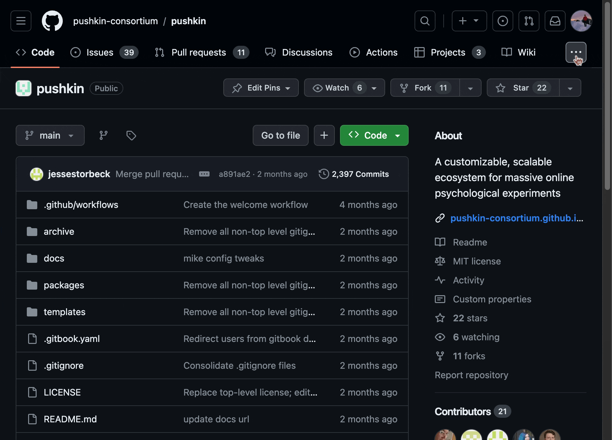

# Reporting security vulnerabilities

## Introduction

We take the security of our software seriously. If you have discovered a security vulnerability in our project, we appreciate your help in disclosing it to us in a responsible manner. This document provides guidelines on how to privately report a security vulnerability using GitHub's security features.

## Finding the Security tab

1. **Navigate to the Repository:** Go to the GitHub repository where the project is hosted.
2. **Locate the Security Tab:** In the repository, you will find a tab labeled “Security” along the top menu. Click on this tab. This section of the GitHub repository is dedicated to security policies and vulnerability reporting.

## Using GitHub's Security Advisory

1. **Create a New Advisory:** In the Security tab, look for a button or link to “Create a new advisory”. Click on this to start the process.
2. **Fill in the Advisory Details:** You will be prompted to fill in the details of the security vulnerability. Provide a clear, concise description of the issue. Include steps to reproduce the vulnerability and any potential impact it could have. Be as detailed as possible while avoiding public disclosure of sensitive information that could lead to exploitation.

## Advisories and Vulnerability Reporting

1. **Temporary Private Fork:** GitHub may create a temporary private fork of the repository for you to work on a fix. This private fork is only visible to repository maintainers and those invited.
2. **Collaborating on a Fix:** Use the temporary private fork to collaborate with project maintainers on developing a fix. Communicate through GitHub's issue tracking and pull request features, keeping all discussion private until the issue is resolved.

## Finalizing the Report

1. **Publishing the Advisory:** Once a fix is ready and the maintainers are prepared to disclose the vulnerability, the advisory can be published. This makes the details of the vulnerability and the fix publicly visible.
2. **CVE Assignment:** GitHub can assign a CVE (Common Vulnerabilities and Exposures) identifier to the vulnerability, providing a standard reference for identifying the security issue.

## Best Practices

- **Do Not Disclose Publicly:** Avoid publicly disclosing the vulnerability before it is resolved. Doing so can put users at risk.
- **Provide Detailed Information:** The more information you can provide about the vulnerability, the better. This includes how it can be exploited, potential impact, and any suggestions for mitigation or resolution.
- **Stay Engaged:** Be prepared to answer further questions or provide additional information if the project maintainers require it.

## Conclusion

Your contributions in reporting vulnerabilities are invaluable to maintaining the security and integrity of the project. We appreciate your support and responsible disclosure, helping us ensure the safety and security of our community.
