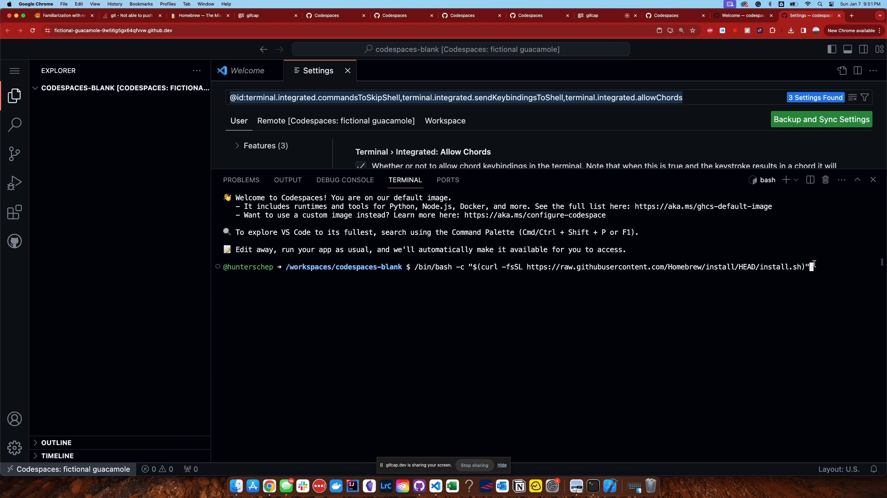

## Getting Started with GitHub Codespaces for Pushkin
**What is GitHub Codespaces?**

GitHub Codespaces is a cloud-based development environment powered by VSCode that allows you to develop entirely in the browser. This service provides a complete, configurable dev environment without the need to install software or configure your local machine.

**Why Use GitHub Codespaces for Pushkin?**

For Windows users encountering issues with local installations of "pushkin", GitHub Codespaces offers a seamless alternative. It eliminates environment-specific issues and ensures you can get up and running quickly, with all the necessary tools and settings pre-configured.

### Setting Up a Codespace 

#### Accessing Codespaces
Visit the main github codespaces page and set up a blank codespace

If it's your first time, you might need to set up a plan or request access, as Codespaces is a paid feature with a free tier available. Since pushkin is installed via the command line, you do not need to open codespaces from the pushkin main repository 

#### Setting up Your Environment
Wait for the environment to build. This process might take a few minutes, especially if this is your first time making a codespace. 

#### Running Pushkin
The terminal in Codespaces acts just like your local one. Once the environment is ready, you can use the same commands you would locally to install and run "pushkin".

For example, this is the first command run in the pushkin installation process to install homebrew, its treated the exact same way when using Codespaces!

### Next Steps 

After setting up your environment in Codespaces, you can proceed just as you would locally. The installation process from here mirrors the installation guide and quickstart. For further instructions and how to use pushkin, please refer to [Installing Pushkin & Dependencies](../installing-pushkin-and-dependencies/macos-install.md) and to the [Pushkin Quickstart](../quickstart/README.md) documentation.