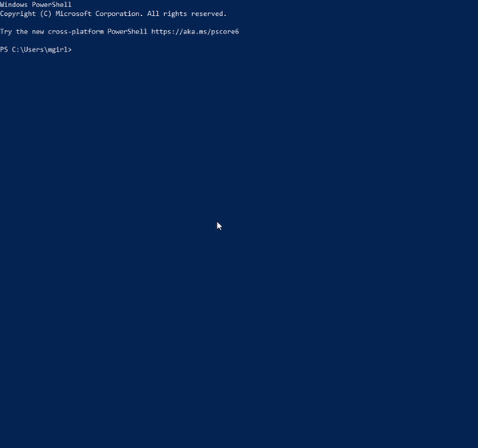
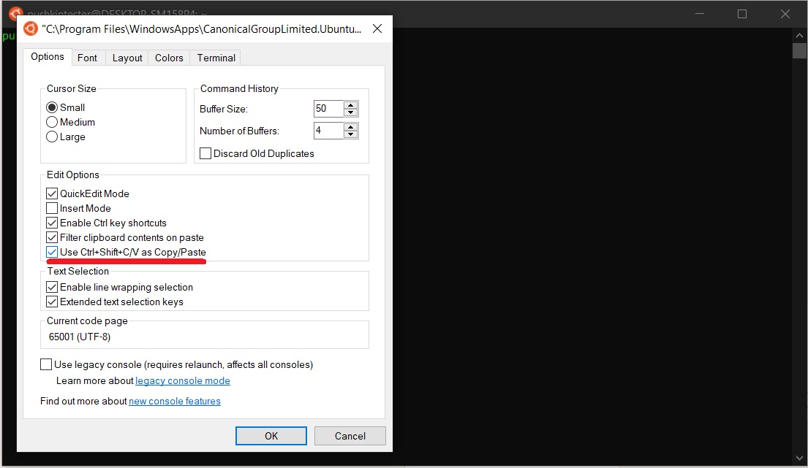
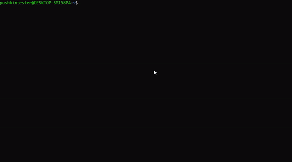

# Installing Pushkin and its dependencies

!!! warning
    **Due to an update in AWS resources, the CLI-based AWS deploy does not currently work and is being updated. In the meantime, you can still manually deploy to AWS.**

The first step for new users of Pushkin is to install Pushkin's command line interface ([pushkin-cli](https://www.npmjs.com/package/pushkin-cli)), along with any of its dependencies which you haven't installed previously. Currently, Pushkin supports installation on macOS, Windows (via Ubuntu Linux), and GitHub Codespaces.

!!! note
    Due to frequent compatibility issues with Windows, we strongly recommend Windows users consider using GitHub Codespaces. Future Pushkin releases may no longer support Windows.

## 1. Setup

=== "Mac"
    If you haven't previously installed [Homebrew](https://brew.sh/), you'll need to install it. If you're not sure if you've previously installed it, you can run:

    ```bash
    brew --version
    ```
    
    If it's installed, you'll see the version (otherwise, the `brew` command will not be found). Installing Homebrew will require Xcode Command Line Tools. If you don't have Xcode Command Line Tools (or the entire Xcode distribution) installed yet, the Homebrew installation will prompt you to install that as well.

=== "Windows"
    !!! note
        Windows users should first complete these setup instructions before doing the setup steps for [Ubuntu Linux](#ubuntu-linux).
    
    To use Pushkin, Windows users need to install Windows Subsystem for Linux (WSL) 2. Note that this process will require restarting your computer multiple times. [This tutorial](https://docs.microsoft.com/en-us/windows/wsl/install) explains how to configure WSL 2 and install a Linux distribution from the Microsoft Store. We recommend using Ubuntu 20.04. 
    
    While we recommend following the tutorial above for the most complete information about installing WSL, in most cases you can simply run Windows PowerShell as an administrator and run:

    ```bash
    wsl --install
    ```
    
    This will install WSL using the default configuration. It will prompt you to reboot your machine when it finishes. Do that, and then continue on.
    
    Pushkin requires using WSL 2. To check which version of WSL you are using, run the following command in Windows Powershell:

    ```bash
    wsl --list --verbose
    ```
    
    
    
    This will give you a list of your installed Linux distributions and what version of WSL they are using. If your distribution is using WSL 1, run:

    ```bash
    wsl --set-version <distribution name> 2
    ```

    The distribution name should be the name given in the previous list for your Linux distribution.
    
    As the tutorial details, you will need Windows 10 version 2004 (or higher) or Windows 11 to be able to use WSL 2. If you follow the instructions in the tutorial and cannot update to version 2004, [these steps](https://www.bleepingcomputer.com/news/microsoft/windows-10-2004-update-not-offered-heres-how-to-get-it-now/) may be able to help.
    
    After you have enabled WSL 2 and installed Ubuntu, you will probably also want to enable copy and paste in the terminal by right-clicking on the terminal window, selecting *Properties* and following [these instructions](https://devblogs.microsoft.com/commandline/copy-and-paste-arrives-for-linuxwsl-consoles/).
    
    
    
    Next, run the following commands in the Ubuntu terminal to update your Ubuntu packages. This (and other commands with `sudo` in front of them) will prompt you to give the Ubuntu password you set up when you installed it. It will also prompt you to respond with `y` and press ENTER to confirm that you would like to install or update software. 

    ```bash
    sudo apt update
    sudo apt upgrade
    ```
    
    
    
    For more on package management with apt, see the [documentation](https://ubuntu.com/server/docs/package-management). To learn more about the basics of the Linux command line, you can follow [this tutorial](https://ubuntu.com/tutorials/command-line-for-beginners#1-overview).

    Next, follow the setup instructions for [Ubuntu Linux](#ubuntu-linux).

=== "Ubuntu Linux"
    !!! note
        These instructions were created using Ubuntu 18.04 and the apt package manager. They should, however, generalize to other Linux distributions and package managers.
    
    Ensure that you have curl installed, as this will be necessary to download Node.js. If it isn't installed, you can install it using the following commands:

    ```bash
    sudo apt update
    sudo apt install curl
    ```
    
    

=== "Codespaces"
    Test

## 2. Install Node

=== "Mac"
    If you haven't installed Node previously, you should install it:

    ```bash
    brew install node
    ```

    You can check your version (or whether you've installed it) with `node --version`.

    You may additionally want to install nvm (Node version manager). To do so, run the following command:

    ```bash
    curl -o- https://raw.githubusercontent.com/nvm-sh/nvm/v0.39.7/install.sh | bash
    ```

    At this point, you may need to close and reopen your terminal for the `nvm` command to be recognized. Then run:

    ```bash
    nvm install 20.2.0
    ```

    See [here](https://github.com/nvm-sh/nvm?tab=readme-ov-file#troubleshooting-on-macos) if installation issues persist.

    If you want to switch your preferred version of Node.js, use the following commands:

    ```bash
    nvm install <node_version>
    nvm use <node_version>
    ```

=== "Ubuntu Linux"
    To install Node.js, first run the following command to install nvm (Node version manager):

    ```bash
    curl -o- https://raw.githubusercontent.com/nvm-sh/nvm/v0.39.7/install.sh | bash
    ```
    
    Then use nvm to install Node.js:

    ```bash
    nvm install 20.2.0
    ```
    
    If the `nvm` command isn't recognized, you may need to close and reopen your terminal. Alternatively, try running `source ~/.bashrc` (see [here](https://github.com/nvm-sh/nvm?tab=readme-ov-file#troubleshooting-on-linux)).
    
    If you want to switch your preferred version of Node.js, use the following commands:

    ```bash
    nvm install <node_version>
    nvm use <node_version>
    ```
    
    

=== "Codespaces"
    Test

## 3. Install Yarn

=== "Mac"
    You will next need to install the Yarn package manager, which will let you download Pushkin. Run the following command:

    ```bash
    brew install yarn
    ```
    
    

    You can check your version with `yarn --version`.

=== "Ubuntu Linux"
    You will next need to install the Yarn package manager, which will let you download Pushkin. Official instructions (copied below for convenience) are available [here](https://classic.yarnpkg.com/en/docs/install/#debian-stable).
    
    Use npm, which comes bundled with Node.js that you just installed:

    ```bash
    npm install --global yarn
    ```
    
    Then check that Yarn is installed by running:

    ```bash
    yarn --version
    ```
    
    
    
    In order to run Pushkin, you'll need to allow yarn to install packages globally. To do so, run the following commands, based on [this Stack Overflow solution](https://stackoverflow.com/questions/40317578/yarn-global-command-not-working/53879534#53879534):

    ```bash
    yarn config set prefix ~/.yarn
    echo -e '\nexport PATH="$PATH:`yarn global bin`"\n' >> ~/.bashrc
    source ~/.bashrc
    ```
    
    

=== "Codespaces"
    Test

## 4. Install yalc

=== "Mac"
    Next, install yalc globally:

    ```bash
    yarn global add yalc
    ```
    
    

=== "Ubuntu Linux"
    Install Yalc globally:

    ```bash
    yarn global add yalc
    ```
    
    

=== "Codespaces"
    Test

## 5. Install pushkin-cli

=== "Mac"
    Then install the Pushkin command line interface globally:

    ```bash
    yarn global add pushkin-cli
    ```
    
    
    
    Confirm that pushkin-cli is installed by running:

    ```bash
    pushkin --help
    ```
    
    You should see a list of commands with some documentation for each.
    
    
    
    Confirm that you have version `2.0.0` or later by running:

    ```bash
    pushkin --version
    ```

=== "Ubuntu Linux"
    Then install the Pushkin command line interface globally:

    ```bash
    yarn global add pushkin-cli
    ```
    
    
    
    Confirm that pushkin-cli is installed by running:

    ```bash
    pushkin --help
    ```
    
    You should get a list of commands with some documentation for each.
    
    
    
    Confirm that you have version `2.0.0` or later by running:

    ```bash
    pushkin --version
    ```

=== "Codespaces"
    Test

## 6. Install Docker

=== "Mac"
    Next, install [Docker](https://docs.docker.com/get-docker/).

    
    
    Confirm that you have at least Docker Engine 23.0 by running `docker --version`.

=== "Ubuntu Linux"
    Next, install Docker Engine using [these instructions](https://docs.docker.com/engine/install/ubuntu/) (copied below for convenience).

    ```bash
    sudo apt-get update
    sudo apt-get install ca-certificates curl gnupg
    ```

    

    Add Docker’s official GPG key:

    ```bash
    sudo install -m 0755 -d /etc/apt/keyrings
    curl -fsSL https://download.docker.com/linux/ubuntu/gpg | sudo gpg --dearmor -o /etc/apt/keyrings/docker.gpg
    sudo chmod a+r /etc/apt/keyrings/docker.gpg
    ```
    
    Use the following command to set up the repository:

    ```bash
    echo \
    "deb [arch="$(dpkg --print-architecture)" signed-by=/etc/apt/keyrings/docker.gpg] https://download.docker.com/linux/ubuntu \
    "$(. /etc/os-release && echo "$VERSION_CODENAME")" stable" | \
    sudo tee /etc/apt/sources.list.d/docker.list > /dev/null
    ```
    
    
    
    Next, update the apt package index:

    ```bash
    sudo apt-get update
    ```
    
    Install Docker Engine, containerd, and Docker Compose:

    ```bash
    sudo apt-get install docker-ce docker-ce-cli containerd.io docker-buildx-plugin docker-compose docker-compose-plugin
    ```
    
    
    
    Check that Docker Engine is installed correctly by running:

    ```bash
    sudo docker run hello-world
    ```

    If Docker Engine and Docker Compose are installed correctly, this should generate some output, including:

    ```
    Hello from Docker!
    This message shows that your installation appears to be working correctly.
    ```

    

    Next, follow [these post-installation instructions](https://docs.docker.com/engine/install/linux-postinstall/#manage-docker-as-a-non-root-user) (copied below for convenience) to manage Docker as a non-root user. You can ignore the other post-installation instructions.

    ```bash
    sudo groupadd docker
    sudo usermod -aG docker $USER
    newgrp docker 
    docker run hello-world
    ```

    

=== "Codespaces"
    Test