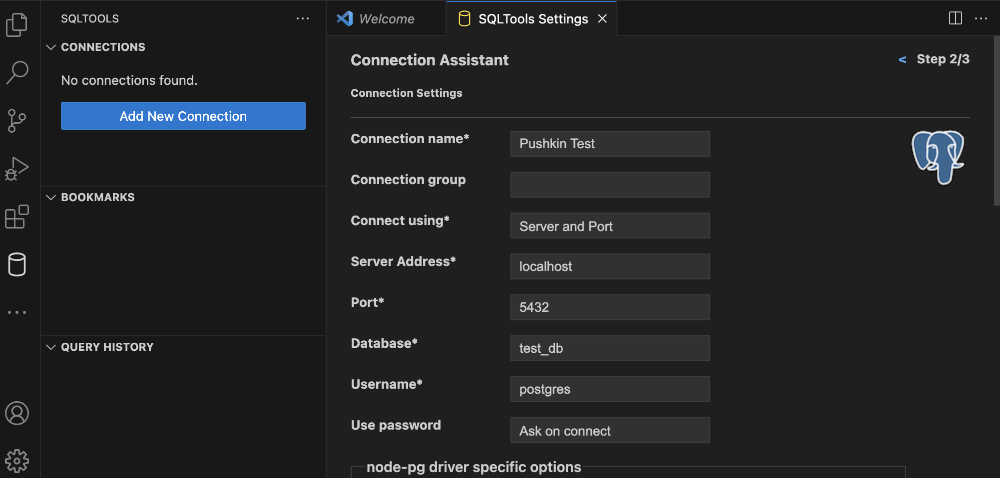
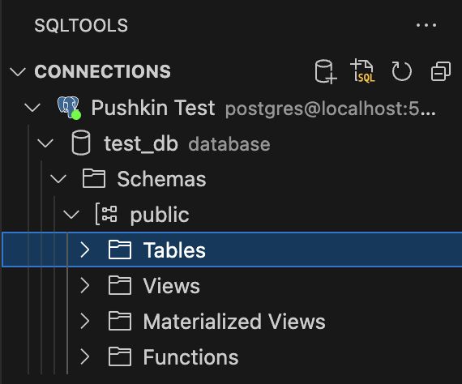

# Quickstart tutorial

!!! note
    You should complete the [installation](installation.md) of pushkin-cli and its dependencies before beginning this tutorial.

## Starting Docker

First, open Docker Desktop and make sure Docker Engine is running. You can check by running `docker ps` in the terminal, which will show a list of your running containers, which should be empty at this point:

```
CONTAINER ID   IMAGE     COMMAND   CREATED   STATUS    PORTS     NAMES
```

If Docker isn't running, you'll see a message that you "cannot connect to the Docker daemon".

## Creating a basic Pushkin site

Create a new directory (e.g., `pushkin_quickstart`) in a location of your choosing (we'll use the Desktop here) and enter this directory using the following commands:

```
cd Desktop
mkdir pushkin_quickstart
cd pushkin_quickstart
```


(For more on basic terminal commands, you can check out [this blog post](https://medium.com/@grace.m.nolan/terminal-for-beginners-e492ba10902a).)

Install your pushkin site in the directory you just created:

```
pushkin install site
```

You will be asked to select a site template to use. Choose **basic**, then choose the recommended version.


This sets up a skeleton website in the current folder and a development database. Once the command finishes, you should have a directory tree like this:

```
├── experiments
├── LICENSE
├── pushkin
│   ├── api
│   ├── docker-compose.dev.yml
│   └── front-end
├── pushkin.yaml
├── README.md
└── users
    ├── config.yaml
    └── migrations
```

### Update site configs

Open `pushkin.yaml` in your project root directory. It should look something like:

```yaml
experimentsDir: experiments
coreDir: pushkin
DockerHubID: ''
databases:
  localtestdb:
    user: postgres
    pass: example
    url: localhost
    port: '5432'
    name: test_db
    host: test_db
  localtransactiondb:
    user: postgres
    pass: example
    host: test_transaction_db
    port: '5433'
    url: localhost
    name: test_transaction_db
info:
  rootDomain: localhost
  whoAmI: Citizen Science Website
  hashtags: 'science, learn'
  email: me@mydomain.com
  shortName: CSW
addons:
  useForum: false
  useAuth: false
salt: abc123
fc:
  popup: false
```

You can ignore most of these settings for now, but you should probably change:

- whoAmI: This is the name of your website that will be displayed to users
- hashtags: These are hashtags used for social media
- email: An email where notifications, etc., will be sent to.
- shortName: An abbreviated name of your website

The one you should _definitely_ change is `salt`. This is used to encrypt private information. Type in any alphanumeric text here, for instance:

```yaml
salt: "cognitivescience"
```

## Adding experiments

To add experiments to your Pushkin site, run:

```
 pushkin install experiment
```

You'll first be asked what you want to name your experiment. Call it `hello`, since we're going to make this experiment a simple "hello, world" example.

Then you'll be asked which experiment template you want to use. The **basic** template is a bare-bones "hello, world" experiment. Choose **basic** and then select the recommended version of the template. Choose 'no' when asked if you want to import a jsPsych experiment (this option only applies to the basic template).

Repeat the process above but this time select the **lexical-decision** template. You can call this one `lexdec`. Now do the same thing for the **grammaticality-judgment** and **self-paced-reading** templates, naming them `gram` and `spr`.


The `experiments` directory of your site should now look like this:

```text
└── gram
    ├── api controllers
    ├── config.yaml
    ├── LICENSE
    ├── migrations
    ├── README.md
    ├── web page
    └── worker
└── hello
    ├── api controllers
    ├── config.yaml
    ├── LICENSE
    ├── migrations
    ├── README.md
    ├── web page
    └── worker
└── lexdec
    ├── api controllers
    ├── config.yaml
    ├── LICENSE
    ├── migrations
    ├── README.md
    ├── web page
    └── worker
└── spr
    ├── api controllers
    ├── config.yaml
    ├── LICENSE
    ├── migrations
    ├── README.md
    ├── web page
    └── worker
```

Each experiment has its own configuration file (`config.yaml`), which allows you to make a number of customizations, e.g. defining a longer human-readable name for the experiment:

```yaml
experimentName: 'My super fun experiment!'
```

## Reorganizing your site for testing/deployment

Keeping all the files for an experiment within the same root folder is convenient for development, but not for actually deploying the website. To reorganize your site for deployment (and local testing), run:

```
 pushkin prep
```


!!! note
    Don't worry: `pushkin prep` won't jumble up the files in the `pushkin_quickstart` directory you created; rather it reorganizes the files into Docker containers. There's never any need to "unprep" your site. You can run `pushkin prep`, make changes in your local site directory, re-run `pushkin prep`, and the changes you made will be reflected in Docker.

## Testing your site locally

Now let’s look at your website! Start your local deploy by running:

```bash
 pushkin start
```


In a web browser, open [localhost](http://localhost) and you should see your site with the experiments you made. Click on the one you called `hello`. It should display "Hello world!". Complete the experiment by pressing any key. If you want to take a look at the other experiments you made, feel free to look over those now too.

When you are done looking at your website, stop the local deploy by running:

```
 pushkin stop
```


If you don’t do that, the web server will keep running in Docker until you quit Docker or restart. When the command has finished running, it should output `done`.

## Updating your site

Imagine now you want to add another experiment or edit an existing one. Every time you update your site, you’ll need to run `pushkin prep` (and `pushkin start` if you want to look at your updates) again:

```
 pushkin prep
 pushkin start
```

## Viewing your data

At this point, you should have generated some data by testing at least one of your experiments. In order to view it, you can use whatever Postgres manager you installed based on the Pushkin [installation instructions](installation.md#installing-a-postgres-manager). Here, we'll go over how to view the data using either pgAdmin or SQLTools.

### Using pgAdmin

When you start pgAdmin, it will take a moment to load and then will appear as a new tab in your web browser. When you install it the first time, it will ask you to set a master password. This can be whatever you'd like, but make sure you keep it in a secure place.


Under _Quick Links_, click **Add New Server**. Make sure you have run `pushkin start` and that your site is running in `localhost`. Then follow these steps:

1. You can set the name of the server to anything, e.g. `Pushkin Testing`.
2. Then move to the _Connection_ tab and set **Host name/address** to `localhost`.
3. Set the password to the default password, `example`, which you can find in `pushkin.yaml`.
4. Click **Save** and your _Pushkin Testing_ server should appear in the left sidebar.


To view your data tables, navigate to the left sidebar:

1. Click to expand your _Pushkin Testing_ server.
2. Select **test_db** under _Databases_.
3. Select **Schemas**, which will also open its subitem **public**.
4. Under **public**, choose **Tables**. 


You should see a list of tables including some that end in `_stimulusResponses` corresponding to each of your experiments. Right click any one of those, hover over _View/Edit Data_, and click on **All Rows**, which will open a new pgAdmin tab displaying the records in that table.


For more information on how to use pgAdmin, you can read their documentation [here](https://www.pgadmin.org/docs/).

### Using SQLTools

The following instructions should work whether you're using the desktop VS Code application or browser-based VS Code via GitHub Codespaces. Assuming you have installed SQLTools and the necessary Postgres driver, click on the SQLTools tab on the left side of the window. Click **Add New Connection** and you'll see some fields you need to fill out:



Name the connection whatever you want. We'll call it `Pushkin Test` here. For the database and username, fill in `test_db` and `postgres` respectively. These are Pushkin's default database configurations. For the _Use password_ field, select **Ask on connect**. Click **SAVE CONNECTION** at the bottom of that screen. You should now be prompted to fill in the password (`example`, unless you changed it earlier in you site's config file).

You should see your connection in the left-hand window of the screen. Now select _Pushkin Test_ > *test_db* > _Schemas_ > _public_ > _Tables_.



You should see a list of tables including some that end in `_stimulusResponses` corresponding to each of your experiments. Right click any of those and select **Show Table Records**. You should now see any data you created for that experiment.

## Starting over

In some cases, you may find that editing your local code does not change what Docker thinks the code is. If you are updating something, but it’s not showing up in localhost, the issue may be related to Docker. You may also see Docker-related error messages. Ideally, in these cases, you should read up on Docker. However, as a fail-safe, you can run `pushkin kill` to delete all your Pushkin-specific code in Docker. Then just run `pushkin prep` again. This will take a while but should address any Docker-specific problems. If you really need a fresh Docker install, run `pushkin armageddon`, which will completely clean Docker.
