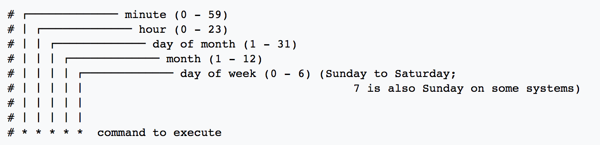

.. _`foundational_quiz_components`:

Foundational Quiz Components
=============================

Front-end Page
---------------
Under the folder 'quiz_page' is housed the React component(s) of a Pushkin quiz. When a user visits the quiz page of the website and clicks a link to a quiz, the default export from index.js is loaded and served on a blank canvas to give over full control of the page.

Database Preparation Process
------------------------------
Before a quiz can be run, and data recorded and stored, the database must contain the appropriate tables, and be seeded with an array of stimuli to present to quiz-takers. This task is handled by files contained in the root db-worker folder.

Database Migrations
^^^^^^^^^^^^^^^^^^^^^^^
Under the migrations folder, you will find several timestamped files for each Pushkin quiz. Each migration file serves to define and create the columns of a database table, by specifying the names and valid data types of each column. Each database table deals with a different aspect of quiz data. Take a look at each of them to see how the database is laid out. Here's the code for the default users table. You might like to add columns to keep track of more demographics

.. code:: javascript

 exports.up = function(knex) {
   return knex.schema.createTable('bloodmagic_users', table => {
     table.increments('id').primary();
     table.string('auth0_id');
     table.timestamp('created_at');
     table.timestamp('updated_at');
     table.date('dob');
     table.string('native_language');
   });
 };

Database Seeds
^^^^^^^^^^^^^^^
The next step is to seed the database, which means adding the initial data. In most cases, this will simply mean adding stimuli to the stimulus table. You should edit this file to add your own stimuli to the database. The quiz's front-end page expects to receive stimuli in JSON format that can be added to its JsPsych timeline.

.. note:: Make sure to edit the quiz files inside your quiz folder under the root 'quizzes' directory. Otherwise it may get overwritten by ``pushkin prep``, which expects quiz files to be inside the quizzes directory.

Cron Scripts
---------------
Cron is a language-agnostic (meaning that code execution is not limited to a subset of programming languages) service for running programming scripts on a scheduled, periodic basis. In the context of Pushkin, cron occupies its own docker container, with its own dependencies, and is composed of two main components:

* Crontab

  This is a configuration file which schedules shell commands for execution. Each line of the crontab specifies a single job,   and that job's schedule. 

  These sample tasks are executing python scripts, and saving their output (If any) to .txt files. 
  
  .. code:: bash

     # Execute every 5 minutes.
     
       5 * * * * root echo "test" >> /scripts/log.txt 

     # Execute at time 00:00 (midnight) every day.
     
       0 0 * * * root /usr/bin/python2.7  /scripts/test.py >> /scripts/log.txt 

     # Execute at 10:00 on the first day of every month.
     
       0 10 1 1 * root /usr/bin/python2.7  /scripts/secondTest.py >> /scripts/out.txt 

     # Execute every minute on Monday only.
     
       1 * * * 1 root /usr/bin/python2.7  /scripts/testBoto.py >> /scripts/out2.txt 

  This system of scheduling is powerful and easy-to-use. 
  
.. note:: Asterisks are wildcard symbols that default to the max value of that field. For more information and to easily generate your own crontab from a friendly interface, see the `crontab guru <https://crontab.guru>`.
    

* Scripts

  The jobs themselves can be written in any programming language, and can perform any required task on schedule. Cron's Dockerfile is set by default to load everything in the scripts directory.

  These scripts may be useful for periodically organizing or analyzing data. Docker provides this container access to your database via an enviroment variable called 'DATABASE_URL', which encodes the username and password as set in the '.env' file as well.

* DockerFile

  This file is responsible for establishing the environment of your docker container, installing necessary dependencies and     packages by running shell commands. For example, the following three commands install curl, then pip, then boto3 for python. 

    * RUN apt-get install curl -y
    * RUN curl --silent --show-error --retry 5 https://bootstrap.pypa.io/get-pip.py | python
    * RUN pip install boto3

API Controller
---------------

The API controller establishes communication endpoints between the front-end, represented by the quiz and user interface, and the back-end, which consists of the database and associated workers. Each endpoint serves as an interface which allows the frontend to make HTTP requests to the core of Pushkin.

A POST endpoint from a quiz controller::

  { path: '/health', method: 'health', queue: db_read_queue },

And the corresponding switch and method in the quiz worker's handlers::

  case 'health':
  // no data fields to require
  return this.health();
  .......
  health() {
    return Promise.resolve({ message: 'healthy' });
  }

Should you need to add your own custom endpoints, simply add a path in your quiz's API controller, a corresponding case in the worker's handler, and whatever functions that method will need.
