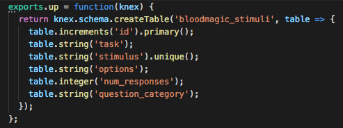
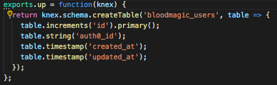
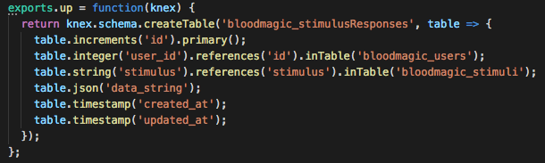
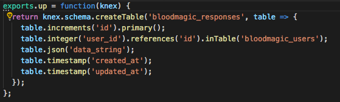
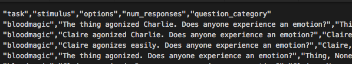

.. _new-quiz:

Creating a Quiz
================

Creating quizzes on Pushkin is straightforward. Start in the root of the Pushkin directory and follow the below steps.

#. From the quizzes/util directory, run ``newQuiz.sh`` and give it the name you would like.
#. Look in quizzes/quizzes/[your quiz name]. You should see some auto-generated folders.
   These are the main components of any Pushkin quiz. See `foundational quiz components`_.
#. Modify your quiz files.
#. From the root of Pushkin, run ``prepareToDeploy.sh`` to, among `other things <prepareToDeploy_>`, handle moving all your quiz components to their appropriate locations in the Pushkin file system and tell Pushkin about their existence.

.. _`foundational quiz components`:
Foundational Quiz Components
=============================

Front-end Page
---------------
Under the folder 'quiz_page', this houses the React component(s) of a Pushkin quiz. When a user visits the quiz page of the website and clicks a link to a quiz, the default export from index.js is loaded and served on a blank canvas to give over full control of the page.

Database Preparation Process
---------------

Before a quiz can be run, and data recorded and stored, the database must contain the appropriate tables, and be seeded with an array of stimuli to present to quiz-takers. This task is handled by files contained in the db-worker folder within root. The first step in the process lies in db-worker/migrations.  

Database Migrations
---------------

Under the migrations folder, you will find four timestamped files for each Pushkin quiz. Each migration file serves to define and create the columns of a database table, by specifying the names and valid data types of each column. Each database table deals with a different aspect of quiz data, and does so by returning a knex schema. These are:

* Quiz Stimuli - Lists all of the available questions for a Pushkin quiz.

Each stimulus entry consists of an ID number, the name of the quiz, the stimulus, answer options, a count of responses to that stimulus, and the category of question.

* Quiz Users - Lists all of the users who have contributed to that quiz.

* Stimulus Responses - Lists all responses given, with stimulus prompt included.

* Responses - Lists all responses given, without stimulus prompt. 

* Stimulus Responses - Lists all responses given, with stimulus prompt included.

* Responses - Lists all responses given, without stimulus prompt. 

Database Seeds
---------------

The next step is a seeder script, which uses a dataset of questions in .csv format to populate the stimuli table for each quiz. Under the seedsThe seeder script is identical across quizzes, but care should be taken to ensure that the columns defined in the seed csv match those defined by the appropriate migrations, as in the sample presented below.

Sample .csv for use in seeding:

Database Prep Commands
---------------

Once prepareToDeploy.sh has been run, the website can be initialized with the command docker-compose -f docker-compose.production.yml up.

This command initalizes docker images from each component of Pushkin, and then deploys them locally within docker containers. However, seeding does not proceed automatically. 

Cron Scripts
---------------
These scripts are optional but may be useful for periodically organizing or analyzing data. Docker provides this container access to your database via an enviroment variable called 'DATABASE_URL', which encodes the username and password as set in the '.env' file as well.

API Controller