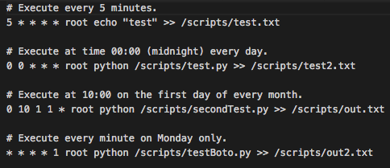

.. _new-quiz:

Creating a Quiz
================

Creating quizzes on Pushkin is straightforward. Start in the root of the Pushkin directory and follow the below steps.

In terminal, run the following commands:

* ./.pushkin/pushkin.sh make quiz [quiz name]
* ./.pushkin/pushkin.sh prep
* ./.pushkin/pushkin.sh compile
* ./.pushkin/pushkin.sh build all
* ./.pushkin/pushkin.sh sync all
* ./.pushkin/pushkin.sh make dockerCompose
* docker-compose -f docker-compose.production.noEnvDependency.yml up

Now, we need to run migrations and seed the database. In terminal, run the following commands:

* docker ps - Copy the container id for db-worker-1.
* docker exec -it [container id] bash
* npm run migrations
* node seeder.js [quiz name]
* exit

All done! The quiz has been made and the appropriate database space has been allocated to it. You are now ready to collect data.

.. _`foundational quiz components`:
Foundational Quiz Components
=============================

Front-end Page
---------------
Under the folder 'quiz_page', this houses the React component(s) of a Pushkin quiz. When a user visits the quiz page of the website and clicks a link to a quiz, the default export from index.js is loaded and served on a blank canvas to give over full control of the page.

Database Preparation Process
---------------

Before a quiz can be run, and data recorded and stored, the database must contain the appropriate tables, and be seeded with an array of stimuli to present to quiz-takers. This task is handled by files contained in the db-worker folder within root. The first step in the process lies in db-worker/migrations.  

Database Migrations
---------------

Under the migrations folder, you will find four timestamped files for each Pushkin quiz. Each migration file serves to define and create the columns of a database table, by specifying the names and valid data types of each column. Each database table deals with a different aspect of quiz data, and does so by returning a knex schema. These are:

* Quiz Stimuli - Lists all of the available questions for a Pushkin quiz.

Each stimulus entry consists of an ID number, the name of the quiz, the stimulus, answer options, a count of responses to that stimulus, and the category of question.

.. image:: stim.png

* Quiz Users - Lists all of the users who have contributed to that quiz.

.. image:: user.png

* Stimulus Responses - Lists all responses given, with stimulus prompt included.

.. image:: stimResp.png

* Responses - Lists all responses given, without stimulus prompt. 

.. image:: responses.png

.. image:: user.png

* Stimulus Responses - Lists all responses given, with stimulus prompt included.

.. image:: stimResp.png

* Responses - Lists all responses given, without stimulus prompt. 

.. image:: responses.png

Database Seeds
---------------

The next step is a seeder script, which uses a dataset of questions in .csv format to populate the stimuli table for each quiz. Under the seedsThe seeder script is identical across quizzes, but care should be taken to ensure that the columns defined in the seed csv match those defined by the appropriate migrations, as in the sample presented below.

Sample .csv for use in seeding:

.. image:: seeds.png

Cron Scripts
---------------

Cron is a language-agnostic (Meaning that code execution is not limited to a subset of programming languages) service for running programming scripts on a scheduled, periodic basis. In the context of Pushkin, Cron occupies its own docker container, with its own dependencies, and is composed of two main components:

* Crontab

This is a configuration file which schedules shell commands for execution. Each line of the crontab specifies a single job, and that job's schedule. 

These sample tasks are executing python scripts, and saving their output (If any) to .txt files. 

This system of scheduling is powerful and easy-to-use. 
.. image:: crontime.png

* Scripts

The jobs themselves can be written in any programming language, and can perform any necessary task on schedule. For example, the following script uses a python package called Boto3 to connect to AWS and upload a file to an S3 bucket.

.. image:: cronBotoScript.png

* DockerFile

This file is responsible for establishing the environment of your docker container, installing necessary dependencies and packages by running shell commands. For example, the following three commands install curl, then pip, then boto3 for python. 

* RUN apt-get install curl -y
* RUN curl --silent --show-error --retry 5 https://bootstrap.pypa.io/get-pip.py | python
* RUN pip install boto3

---------------

These scripts are optional but may be useful for periodically organizing or analyzing data. Docker provides this container access to your database via an enviroment variable called 'DATABASE_URL', which encodes the username and password as set in the '.env' file as well.

API Controller
---------------
